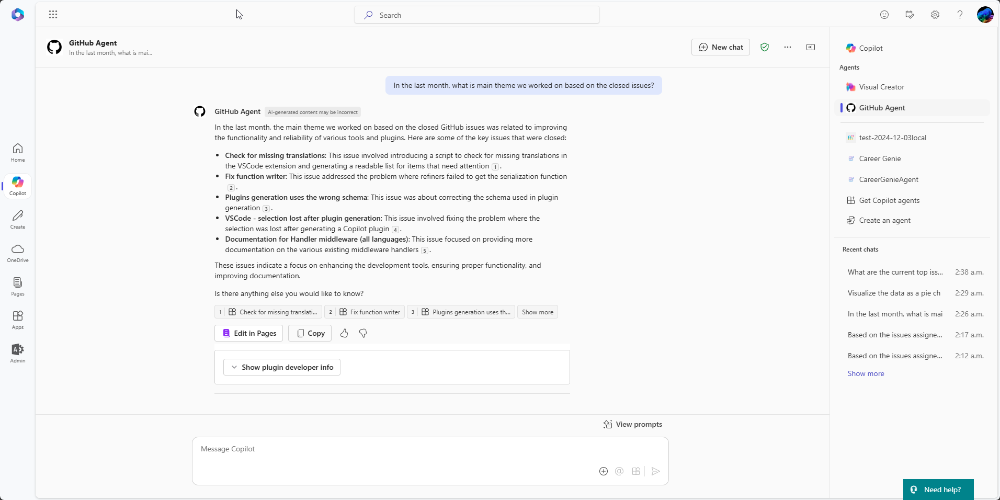

# GitHub Issues Agent

## Summary

This sample project uses Teams Toolkit for Visual Studio Code to simplify the process of creating an [agent](https://learn.microsoft.com/microsoft-365-copilot/extensibility/overview-declarative-agent) that connects to data from the GitHub Issues connector and can help with automating tasks like assigning and closing issues.

## Features

This sample shows how to build an agent that can respond to user prompts and provide information based on the GitHub Issues connector. The agent can:

- List the latest issues
- Understand the issues and summarize them
- Assign issues to specific GitHub users
- Close issues
- Get documentation from the GitHub Issues documentation page
- Provide visualizations of the issues based on the Code Interpreter capability

## Contributors

- [Sébastien Levert](https://github.com/sebastienlevert)

## Version History

Version|Date|Comments
-------|----|--------
1.0|December 03, 2024|Initial release

## Prerequisites

- [Teams Toolkit for Visual Studio Code](https://marketplace.visualstudio.com/items?itemName=TeamsDevApp.ms-teams-vscode-extension)

## Minimal path to awesome - Debug against a real Microsoft 365 tenant

- Clone repo
- Open repo in VSCode
- Create a GitHub OAuth app
  - Go to [GitHub](https://github.com)
  - Click on your profile picture and select **Settings**
  - In the left sidebar, click on **Developer settings**
  - In the left sidebar, click on **OAuth Apps**
  - Click on **New OAuth App**
  - Provide the required information
    - Name: `Issues Agent`
    - Homepage URL: `https://contoso.com`
    - Application description: `Simple agent to interact with GitHub Issues`
    - Authorization callback URL: `https://teams.microsoft.com/api/platform/v1.0/oAuthRedirect`
    - Enable Device flow: **Checked**
  - Click on **Register application**
  - Copy the **Client ID**
  - Click on **Generate a new client secret**
  - Copy the **Client secret**
- Copy the environment files in the `env` folder
  - Copy the `.env.dev.sample` file to `.env.dev`, fill in the values and add your GitHub app client ID as the `GITHUB_APP_CLIENT_ID` value
  - Copy the `.env.dev.user.sample` file to `.env.dev.user` and add the your GitHub token as the `GITHUB_APP_CLIENT_SECRET` value
- Navigate to the **Teams Toolkit** view in VS Code
- In the **Lifecycle** section, click on **Provision** to deploy your application
- Wait for all tasks to complete
- Navigate to [Microsoft 365 Copilot](https://m365.cloud.microsoft/chat)
- Select the **GitHub Agent** from the list of agents
- Select the first conversation starter `In the last month, what is main theme we worked on based on the closed issues?`. You should see the following result:

> [!NOTE]  
> It can take a moment for the results to appear. If you don't see the results immediately, wait a few moments and try again.
